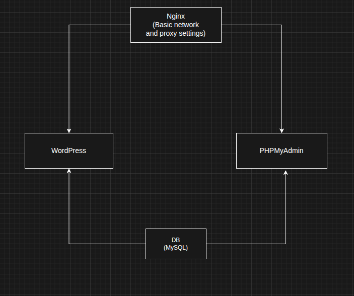

# Cloud-1

A cloud deployment project that automates the provisioning and deployment of a WordPress stack on a remote server using **Ansible** and **Docker Compose**.

## Architecture



## Stack

| Service | Role |
|---------|------|
| Nginx | Reverse proxy, SSL termination, HTTP→HTTPS redirect |
| WordPress (PHP-FPM) | Application server via FastCGI |
| MySQL 8.0 | Database backend |
| phpMyAdmin | Database management UI at `/admin/` |

All services run in an isolated Docker bridge network (`cloud-1`) and are never exposed directly — only Nginx is reachable from the outside on ports 80 and 443.

## Project Structure

```
cloud-1/
├── ansible/
│   ├── playbook.yml              # Main playbook (docker → ssl → deploy)
│   ├── inventory/
│   │   ├── hosts.ini             # Target server(s)
│   │   └── host.ini.example      # Inventory template
│   └── roles/
│       ├── docker/
│       │   └── tasks/main.yml    # Install Docker & Docker Compose
│       ├── ssl/
│       │   └── tasks/main.yml    # Generate self-signed TLS certificate
│       └── deploy/
│           └── tasks/main.yml    # Copy sources and run docker-compose
└── srcs/
    ├── docker-compose.yml        # Service definitions
    ├── .env                      # Environment variables (secrets)
    ├── .env.example              # Environment variable template
    ├── nginx/
    │   ├── Dockerfile
    │   └── conf/nginx.conf       # Nginx config with SSL & FastCGI
    └── wordpress/
        └── Dockerfile
```

## How It Works

The Ansible playbook runs three roles in sequence on the target server:

1. **docker** — Installs Docker CE and Docker Compose from the official repository
2. **ssl** — Generates a self-signed RSA-2048 certificate valid for 365 days under `/etc/nginx/ssl/`
3. **deploy** — Copies the `srcs/` directory to `/opt/cloud-1/` and runs `docker-compose up -d --build`

Nginx listens on port 80 and redirects all traffic to HTTPS (443). PHP requests are proxied to the WordPress FPM container, and `/admin/` is reverse-proxied to phpMyAdmin.

## Prerequisites

- Ansible installed on your local machine
- A remote Ubuntu server accessible via SSH
- Python 3 on the remote server

## Setup

### 1. Configure the inventory

```bash
cp ansible/inventory/host.ini.example ansible/inventory/hosts.ini
```

Edit `ansible/inventory/hosts.ini`:

```ini
[servers]
YOUR_SERVER_IP ansible_user=YOUR_USER ansible_password=YOUR_PASSWORD
```

### 2. Configure environment variables

```bash
cp srcs/.env.example srcs/.env
```

Edit `srcs/.env` with your credentials:

```env
MYSQL_ROOT_PASSWORD=your-password
MYSQL_DATABASE=your-db-name
MYSQL_USER=your-db-user
MYSQL_PASSWORD=your-db-password
WORDPRESS_DB_HOST=wordpress
WORDPRESS_DB_NAME=your-db-name
WORDPRESS_DB_USER=your-db-user
WORDPRESS_DB_PASSWORD=your-db-password
PMA_HOST=your-pma-host
PMA_USER=your-pma-user
PMA_PASSWORD=your-pma-password
```

### 2-1. Encrypt environment variables (recommended)

```bash
ansible-vault encrypt srcs/.env --vault-password-file .vault_pass
```

Then deploy with:

```bash
ansible-playbook ansible/playbook.yml -i ansible/inventory/hosts.ini --vault-password-file .vault_pass
```

> Make sure `.vault_pass` is added to `.gitignore`.

### 3. Deploy

```bash
ansible-playbook ansible/playbook.yml -i ansible/inventory/hosts.ini
```

## Accessing the Services

| URL | Service |
|-----|---------|
| `https://<server-ip>/` | WordPress |
| `https://<server-ip>/admin/` | phpMyAdmin |

> The self-signed certificate will trigger a browser warning. Accept it or replace the certificate with a CA-signed one (e.g. Let's Encrypt).
