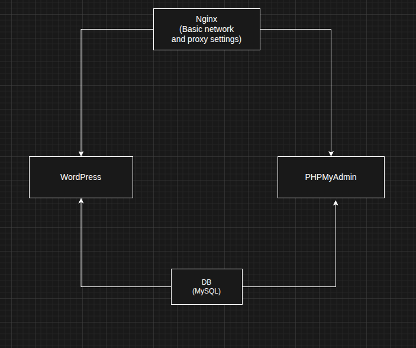

# Cloud-1

Cloud-1 deploys a small self-hosted WordPress environment to an Ubuntu host. The existing Ansible + Docker Compose architecture is retained: Nginx terminates TLS and is the only service published on the host; application, database, administration, and monitoring services communicate on an isolated Compose network.

## Architecture



```
Internet
  │ :80, :443
  ▼
Nginx ──FastCGI──► WordPress/PHP-FPM ──► MySQL
  │
  ├── /admin/ ───► phpMyAdmin
  └── /grafana/ ─► Grafana ────────────► Prometheus ──► node_exporter
```

All containers use the user-defined `cloud-1` bridge network. Docker DNS resolves service names such as `mysql`, `wordpress`, and `grafana` inside the stack. Named `mysql` and `wordpress` volumes retain database and application data across container recreation.

| Service | Responsibility | Host exposure |
| --- | --- | --- |
| Nginx | TLS termination, HTTP-to-HTTPS redirect, WordPress FastCGI and admin reverse proxy | **80/tcp, 443/tcp only** |
| WordPress/PHP-FPM | WordPress application | Internal FastCGI 9000 |
| MySQL | WordPress data store | Internal 3306 |
| phpMyAdmin | MySQL administration UI | Internal; proxied at `/admin/` |
| node_exporter | Host OS metrics exporter | Internal 9100 |
| Prometheus | Metrics collection and storage | Internal 9090 |
| Grafana | Metrics dashboards | Internal; proxied at `/grafana/` |

Neither Grafana nor phpMyAdmin is published with Docker `ports`; their only access path is Nginx. MySQL, WordPress, Prometheus, and node_exporter are likewise not host-published.

## Security model and secrets

`/admin/` and `/grafana/` require the same Nginx HTTP Basic Authentication credentials before the application’s own login screen. Set `ADMIN_BASIC_AUTH_USER` and `ADMIN_BASIC_AUTH_PASSWORD` in `srcs/.env`. Nginx creates the bcrypt htpasswd file inside its container at startup; no hash or credential is committed.

The `.env` file is intentionally ignored. It contains MySQL, WordPress, Nginx-admin, and first-run Grafana credentials. `.env.example` is committed only as a fake-value template. Do not use its values in a deployed system. phpMyAdmin is configured only with `PMA_HOST=mysql` and `PMA_PORT=3306`; it receives no saved database username/password, so authenticate explicitly using a MySQL account.

Grafana’s `GRAFANA_ADMIN_*` variables establish its administrator only on first initialization. Set `GRAFANA_DOMAIN` to the public DNS name or IP through which Nginx is reached; it lets Grafana generate redirects and assets correctly beneath `/grafana/`. The current Compose configuration does not persist Grafana state in a named volume, so recreating its container re-applies those first-run credentials and removes local dashboard changes; the provisioned Prometheus datasource and node-exporter dashboard remain available. This is appropriate for this small project but not a backup strategy.

For an encrypted local secret file, use Ansible Vault. Keep the vault password file outside Git (`.vault_pass` is ignored):

```bash
cp srcs/.env.example srcs/.env
# Edit srcs/.env with unique long random values first.
ansible-vault encrypt srcs/.env --vault-password-file .vault_pass
```

Never commit an unencrypted `.env`, `hosts.ini`, or vault password file.

## Pinned images

The project deliberately pins image tags rather than using `latest`:

| Image | Version |
| --- | --- |
| Nginx | `1.28.0-alpine` |
| WordPress PHP-FPM | `6.8.3-php8.1-fpm-alpine` |
| MySQL | `8.4.11` |
| phpMyAdmin | `5.2.2-apache` |
| node_exporter | `v1.9.1` |
| Prometheus | `v3.4.0` |
| Grafana | `12.0.2` |

Tags provide repeatable builds but are not immutable supply-chain locks. For a stricter deployment, pin each image to a reviewed digest after testing an update.

## Prerequisites

- Control machine: Ansible Core and the required collection:

  ```bash
  ansible-galaxy collection install -r ansible/requirements.yml
  ```

- Target: a supported Ubuntu release, reachable over SSH, with Python 3 and an account that can become root. The playbook adds Docker’s official Ubuntu repository using the target’s detected Ubuntu codename and architecture (including `x86_64 → amd64` and `aarch64 → arm64`).
- Firewall/security-group rules permitting TCP 80 and 443 only, plus SSH from an appropriate administration network.

## Deploy

1. Create private local configuration.

   ```bash
   cp ansible/inventory/host.ini.example ansible/inventory/hosts.ini
   cp srcs/.env.example srcs/.env
   chmod 600 ansible/inventory/hosts.ini srcs/.env
   ```

   Prefer SSH keys. If a password inventory is unavoidable, keep it only in ignored `hosts.ini` and consider `ansible-vault encrypt ansible/inventory/hosts.ini`.

2. Edit `srcs/.env`. The critical database relationship is:

   ```env
   WORDPRESS_DB_HOST=mysql:3306
   PMA_HOST=mysql
   PMA_PORT=3306
   GRAFANA_DOMAIN=your-server.example.com
   ```

   `mysql` is the Compose service name and therefore the correct internal DNS target. Do not set it to `wordpress`.

3. Optionally encrypt `.env`, then deploy:

   ```bash
   ansible-playbook -i ansible/inventory/hosts.ini ansible/playbook.yml
   # With an encrypted .env:
   ansible-playbook -i ansible/inventory/hosts.ini ansible/playbook.yml --vault-password-file .vault_pass
   ```

Ansible installs Docker Engine, Buildx, and Compose v2; creates a self-signed TLS certificate at `/etc/nginx/ssl`; copies `srcs` to `/opt/cloud-1`; and converges the Compose project. Re-running the playbook preserves the certificate, detects unchanged copied files, and asks Compose to recreate only services whose configuration or image requires it. Replace the self-signed certificate with a CA-issued certificate before public use.

## Verify

Run on the Ubuntu host after deployment:

```bash
cd /opt/cloud-1
sudo docker compose config
sudo docker compose ps
sudo docker compose logs --tail=100 nginx mysql wordpress prometheus grafana
curl -kI https://localhost/
curl -kI https://localhost/admin/             # expect 401 without Basic Auth
curl -kI -u 'cloud1-admin:YOUR_ADMIN_PASSWORD' https://localhost/admin/
curl -kI -u 'cloud1-admin:YOUR_ADMIN_PASSWORD' https://localhost/grafana/
sudo docker compose exec nginx nginx -t
sudo docker compose exec prometheus wget -qO- http://localhost:9090/-/healthy
sudo docker compose exec grafana wget -qO- http://localhost:3000/api/health
```

Use `https://SERVER_NAME_OR_IP/` for WordPress, `https://SERVER_NAME_OR_IP/admin/` for phpMyAdmin, and `https://SERVER_NAME_OR_IP/grafana/` for Grafana. Browser warnings are expected with the generated self-signed certificate.

## Observability

Prometheus scrapes itself and node_exporter every 15 seconds. node_exporter is given host PID and a read-only host-root mount so its metrics represent the Ubuntu host rather than only its container. The provisioned Grafana datasource points to `http://prometheus:9090`, and the included dashboard shows node-exporter data.

This demonstrates host availability and resource pressure plus Prometheus’s own scrape health. It does **not** expose MySQL query/replication metrics, PHP-FPM metrics, Nginx request metrics, or a WordPress application transaction. Docker health checks provide a useful readiness signal for MySQL, Prometheus, Grafana, and node_exporter, but WordPress uses PHP-FPM rather than HTTP, so there is no end-to-end WordPress health endpoint in this scope. Check `docker compose ps` and the external HTTPS request above to distinguish container liveness from user-facing availability. node_exporter’s read-only host-root mount is deliberately privileged enough to observe the host; restrict Docker socket/root access on the VM accordingly.

## Cleanup

To stop the stack while retaining WordPress and MySQL data:

```bash
cd /opt/cloud-1
sudo docker compose down
```

To intentionally destroy the database and WordPress volumes as well (irreversible without backups):

```bash
cd /opt/cloud-1
sudo docker compose down -v
```

The generated TLS files remain under `/etc/nginx/ssl` until removed separately. Back up MySQL before destructive cleanup.
